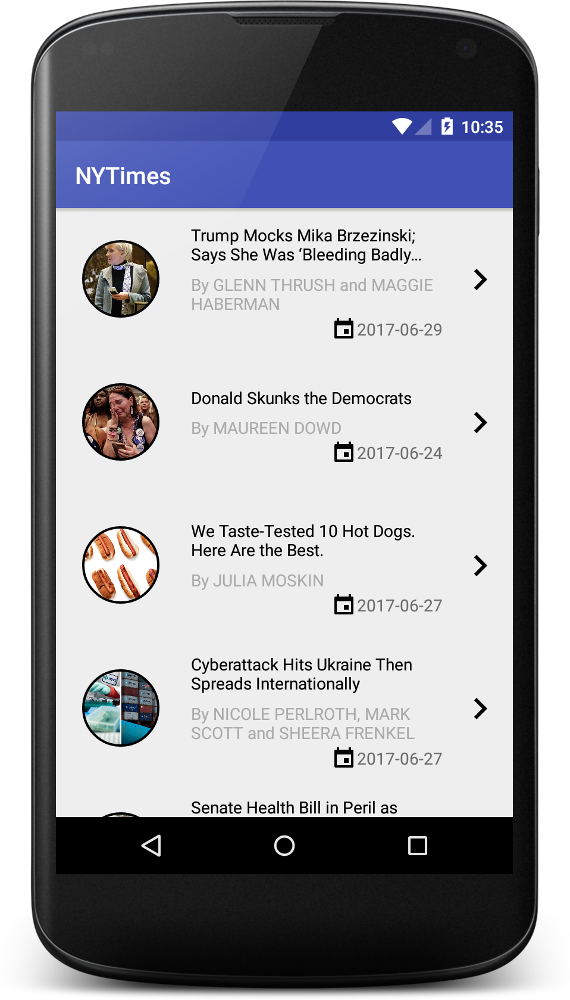

# NYTIMES API demo

This is a demo Android application to download and show articles from the NYTimes API.

If you want to try it out, you need to have a `NYTimes API key`. You can get one from here:
https://developer.nytimes.com/signup (you have to choose the `Most popular` API)

When you got the key, insert it in the project's root folder! Just create a file,
called `gradle.properties` and put this single line into it:
`APIKey="YOUR_API_KEY"`

If you want to build the application, just run this gradle task from the projet's directory:
`./gradlew assembleDevDebug`

##Dependencies
The application uses a lot of libraries:
-   Dagger2 for dependency injection
-   OkHTTP and Retrofit for networking with GSON
-   Stetho to monitor network requests
-   ButterKnife for View binding
-   MaterialDialogs for the unified dialog presentation (on every API level)
-   Picasso for image downloading

 