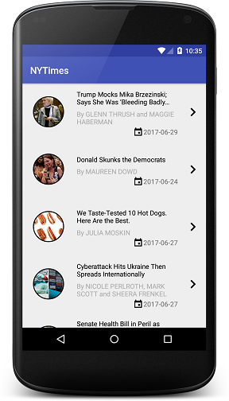

# NYTIMES API demo

This is a demo Android application to download and show articles from the NYTimes API.

If you want to try it out, you need to have a `NYTimes API key`. You can get one from here:
https://developer.nytimes.com/signup (you have to choose the `Most popular` API)

When you got the key, insert it in the project's root folder! Just create a file,
called `gradle.properties` and put this single line into it:
`APIKey="YOUR_API_KEY"`

If you want to build the application, just run this gradle task from the project's directory:
`./gradlew assembleDevDebug`. You can find the assembled APK in the `app/build/outputs/apk` folder.

Or you can simply import it into Android Studio, and press the `Run` button :) 

## Architecture

The application has separated components. These components are managed by the DI framework (Dagger2).
The UI has been implemented with MVP design pattern. These two solutions providing us the ability
to test the application without real networking. Every part of the structure is mockable.

## Unit testing

There is 3 simple example unit tests to test the mockable network calls. If you want to run them,
just call this gradle task in the project's root folder:
`./gradlew testDevDebugUnitTest`

## Dependencies

The application uses these 3rd party libraries:

-   Dagger2 for dependency injection
-   OkHTTP and Retrofit for networking with GSON
-   Stetho to monitor network requests
-   ButterKnife for View binding
-   MaterialDialogs for the unified dialog presentation (on every Android API level)
-   Picasso for image downloading
-   ChromeCustomTabs to show the article in a browser

## Further improvements:
Because of time limitations, I couldn't finish the whole job. There are a lot of possible improvements:

-   UI testing, with the same mocked network call
-   About screen with the licenses of the used libraries
-   Copyright notice
-   Tablet compatible layout

## Copyright:

The application made for demo purposes, and the API is belongs to The New York Times.

Inotay Krisztián - 2017

 